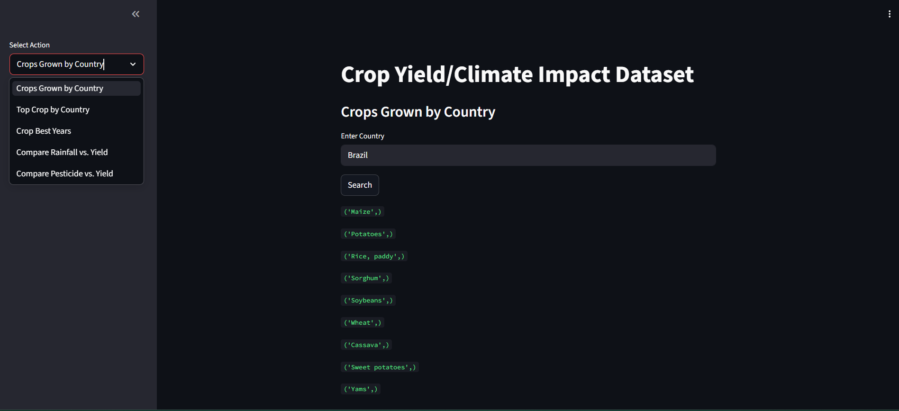

# cop-3701-Crop-Yield-Climate-Impact-Database

## Project Scope
The goal of this project is to create a database that stores crop yield data, climate, and human factors. This data will be used to analyze correlations and support future crop yield predictions. Using yield, pesticide, and climate factors to make statistical predictions.

## Users
- Farms seeking to predict crop yield
- Researchers studying the impact of climate on crops

## Data Sources
- Crop Yield Prediction Dataset (Kaggle):  
  https://www.kaggle.com/datasets/patelris/crop-yield-prediction-dataset

## Final ER Diagram

## How to Use This Repo
Step 1: Use the “create_db.sql” to create the database
Step 2: Use the dataload.py to populate the database with crop data
Step 3: Change the line 8 to line 13 in magdalene_symanski_parte/app.py and add your database credentials
Step 4: run the app.py using the commands below
- pip install streamlit pandas oracledb
- streamlit run magdalene_symanski_parte/app.py

